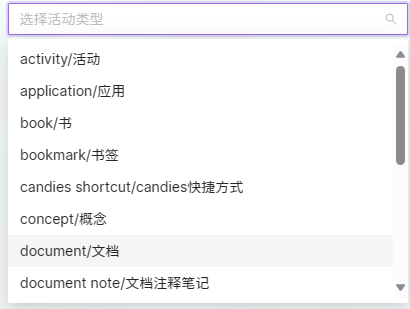

## Introduction

Records tool for xyqlx.

## Background

The recording tool only implemented a small part of the excessive inspiration it contained. It may be xyqlx's largest and longest frontend project, with over 10,000 lines of code. However, it is not difficult to manage because some modules are on the same level.

Recently, some initial ideas have become outdated due to the growth of experience and the development of natural language models.

It is not open source. It is a purely personal project that is not intended to serve general needs and has very little value.

## What is it

### Introduction to underlying settings

Taking a normal text record (such as a diary) as an example, we can consider it as a Note type. The properties of this Note include:

* id
* type (Note)
* creation time
* last modified time
* title
* tags
* content

The content can consist of multiple Passage types, and the content of a Passage can consist of multiple Paragraphs. The content of a Paragraph can consist of multiple Sentences. A Sentence is the smallest unit, and its content consists of multiple words. Each word has a property that represents its content as a string and its modifiers.

These types are collectively referred to as Candies. xyqlx uses MongoDB to store this data. The specific storage method is to store all Candies in a collection, with each Candy having a unique id, which is used to reference each other.

This fine-grained format is convenient for special annotations of a specific part of a record (such as emphasis or links). When the input is plain text, xyqlx uses line breaks and Jieba word segmentation to convert it into the format in the database. The reverse conversion is easier to implement.

PS: Considering the development trend of natural language processing represented by GPT, this word-based recording method has obvious disadvantages. xyqlx is considering whether to store large sections of text together and use external information to achieve fine-grained annotations.

Of course, since it is so fine-grained, it is obviously not limited to plain text. In order to create multimedia types of Candies, xyqlx needs to standardize the resources used in all notes. The information of these resources is saved as Activities in the database. The following image shows some types of Activities.

That's all for the introduction. It is obvious that this complex system requires diligent annotations to be effective. This is also the reason why xyqlx has been trying to improve the overall structure. The purpose of creating this toy is not to increase one's workload.

So, why not use existing note-taking software?

In fact, OneNote is a good choice. It was also the only designated note-taking tool for xyqlx in the early days. It was abandoned because Microsoft stopped supporting the freely exportable local version of OneNote, and because it lacked certain features (such as tags). xyqlx's research on the OneNote program interface and note format was basically conducted at this time.

Most other software is based on Markdown, and xyqlx has no objections to this format. However, due to the influence of OneNote, xyqlx is very persistent in recording the input time of each sentence. However, Markdown does not support this operation (PS: Setting aside the significance of this data, it now appears that there are alternatives).

Although Candies is a relatively unsuccessful work, in a positive sense, it has at least preserved some fragments of xyqlx's life. xyqlx is a very forgetful person and believes that memory constitutes the existence of "self". What was the past self like? What forgotten things did it experience in the past? What meaningless thoughts did it have? Only the "present self" would be interested in these things. That is the value of Candies.

### Functions

* View Recent Notes
* Filter Notes based on tags or search terms
* Add Note as plain text
* Viewing, Adding, Editing, and Modifying Activities
* Tag Notes

### Version Name

The UI has been updated, but unfortunately, the interface of the first version of Candies was not preserved. The current version is named "Transparent Hairpin" and matches the interface style.

The previous version was named "Strawberry Cake".

## Tech Stack

Frontend: Angular
Backend: ASP.NET
Database: MongoDB
