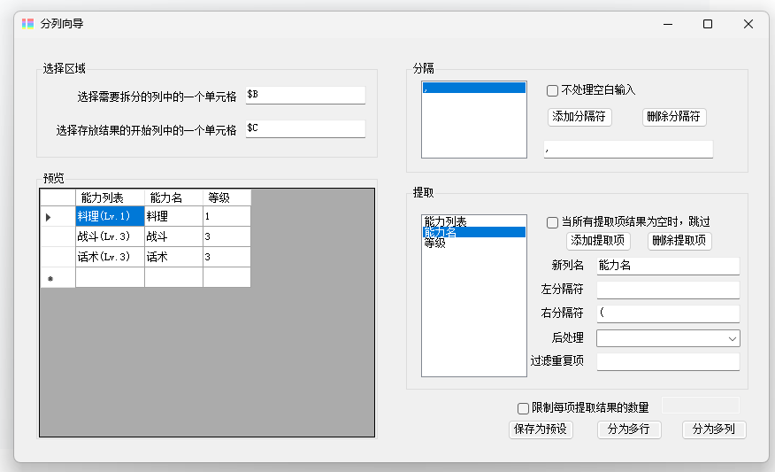

## Introduction

An Excel plugin that helps with column and row splitting.

## Note: This project is provided only in Chinese.

## Background

Excel is still widely used in some places for data processing, and there are data formats that are more suitable for humans than machines.

xyqlx will first try to use Excel for processing (in fact, the functions of this tool can all be implemented through PowerQuery), and then consider using Python to process the table as a CSV.

As for why xyqlx wrote an Excel plugin, it is because ordinary users resist the above two methods.

This tool only provides an optional solution. Based on xyqlx's experience, various strange formats, such as inconsistent full-width and half-width characters, and meaningless white spaces, will also appear in real-life scenarios.

The underlying framework of this project, VSTO, is a technology that is becoming outdated, and even the GUI defaults to WinForm. xyqlx chose this instead of Web add-ins because it is too complicated to publish.

## Features

### Core Features

Processing data like this:

| Role | Abilities |
| --- | --- |
| sanae | Cooking(Lv.1),Combat(Lv.3),Conversation(Lv.3) |
| daiyosei | Gathering(Lv.3),Fishing(Lv.1) |

And converting it to the following format:

| Role | Ability | Level |
| --- | --- | --- |
| sanae | Cooking | 1 |
| sanae | Combat | 3 |
| sanae | Conversation | 3 |
| daiyosei | Gathering | 3 |
| daiyosei | Fishing | 1 |

Or in column format:

| Role | Ability1 | Level1 | Ability2 | Level2 | Ability3 | Level3 |
| --- | --- | --- | --- | --- | --- | --- |
| sanae | Cooking | 1 | Combat | 3 | Conversation | 3 |
| daiyosei | Gathering | 3 | Fishing | 1 | | |

Although the above functions can be easily achieved using Excel itself, this plugin may save some operations.

The key steps of the operation are divided into two parts:

1. Splitting: Split the content of each cell into multiple parts based on the specified delimiter (e.g., comma).
2. Extraction: Extract multiple values for each split part according to certain rules.

### Preview

The plugin will attempt to find the first non-empty cell as an example and display the resulting split rows.

### Handling Empty Cells

Before splitting, you can select "Skip Empty Inputs" to skip rows with empty cells.

The option "Skip when all extracted items are empty" is triggered after the extraction process. If all values extracted from a split part are empty, then the saving of that split part will be skipped.

### Post-processing

After the extraction is completed, you can further process the extracted results. Currently, only the function of extracting provinces is supported.

### Filtering Duplicates

This feature is for cases where it is required to discard a split part if it conflicts with a previous column. For example:

| Role | Talent Ability | Ability List |
| --- | --- | --- |
| sanae | Conversation | Cooking(Lv.1),Combat(Lv.3),Conversation(Lv.3) |
| daiyosei | Gathering | Gathering(Lv.3),Fishing(Lv.1) |

If you only want to save non-talent abilities, you can click on the "Filter Duplicates" text box to select the target column to compare against.

### Limiting Extraction Results

This is basically limiting the number of splits, but here, it considers the case where some split parts may be filtered out during the process.

### Presets

If you have a fixed file format to process, you can save the parameters of a split in the "Splitting Wizard" window and load them in the "Presets" window.

PS: The default save path for presets is `C:\Users\[username]\AppData\Local\Apps\2.0\Data\[something]\[something else]\exce..vsto_...\Data\[excel version]`.

## Current Issues

* Has not been tested with non-text content in the table, it will likely cause issues.
* Only applicable if the table starts from the first row.

## TODO

* Support starting from any row.
* Allow presets to be applied to multiple files in batch.

## Others

Since I haven't written any unit tests or tried many test cases, there may be many bugs. Feedback is welcome.
