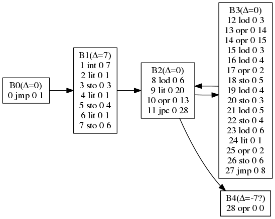
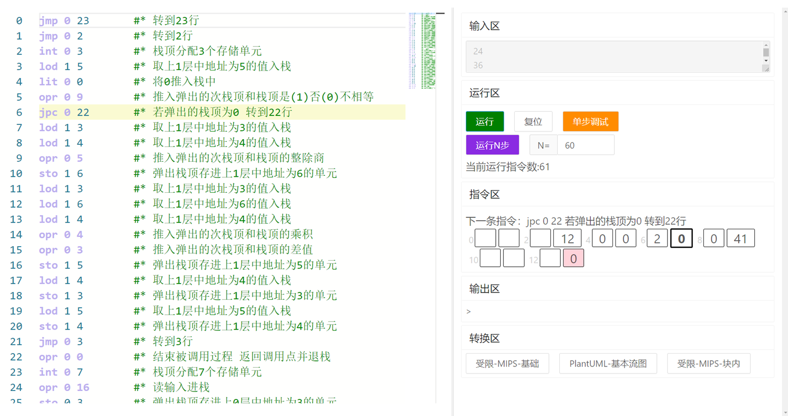

## Introduction

This project implements a simple online P-code interpreter.

## Background

This is part of the Compiler Principles training in the Computer Systems Engineering comprehensive practice.

### Objectives and Content of the Experiment

The purpose of "Computer Systems Engineering Comprehensive Practice" is to allow students to complete practical designs in computer organization and architecture, operating systems, compiler principles, and interface technology on a unified experimental platform, ultimately forming a consistent and complete concept of the overall computer system.

Among them, compiler principles, as a core course in the field, enable students to write efficient, robust, and memory-efficient programs. In "Computer Systems Engineering Comprehensive Practice," by connecting the compiler principles training with the computer organization and architecture training, the relationship and logical hierarchy of various software/hardware components within a computer system can be demonstrated, thereby enhancing students' system integration capabilities.

The compiler principles training is an experiment in which the target code generation program is performed on a model computer that has already completed the computer organization and architecture training. The target code is MIPS assembly language code.

The compiler principles training requires students to master the PL/0 compilation program and learn MIPS assembly language. They need to modify the PL/0 compilation program to translate PL/0 source code into MIPS assembly code. This assembly code is then assembled and executed in QtSpim to obtain the simulation results of the PL/0 source program.

### Experiment Content

1. This experiment provides a PL/0 compilation program written in the C language. Students are required to understand the structure of the target code (P-code language), error handling, storage allocation, and execution process of the PL/0 compilation program based on interpreting the PL/0 compilation program.
2. Learn 32-bit MIPS assembly language, understand its register types, arithmetic and addressing instructions, program structure, and system calls, and be able to write programs using MIPS assembly instructions. Learn to use the QtSpim software to assemble and simulate the execution of MIPS assembly instruction source programs.
3. Modify the interpret() function and corresponding program code in the PL/0 compilation program to translate the P-code intermediate code into MIPS assembly instructions and generate MIPS assembly code files. Alternatively, modify the gen() function in the PL/0 compilation program and call the gen() function to generate MIPS assembly instructions when each statement in the analysis program is syntactically correct, and generate MIPS assembly code files.
4. Debug and modify the modified PL/0 compilation program in the C language compilation environment, compile and run it successfully. Obtain the corresponding MIPS assembly code file according to the PL/0 test cases. Then assemble and run the MIPS assembly code file in QtSpim to simulate the results.

### References

#### P-code Instructions

| P-code Instruction | P-code Interpretation |
| -- | -- |
| INT 0 A | Allocate A storage units at the top of the stack |
| OPR 0 0 | End the called procedure, return to the calling point and pop the stack |
| CAL L A | Call the procedure at address A, with a level difference of L between the calling and called procedures |
| LIT 0 A | Store the immediate number A in the unit pointed by t, t+1 |
| LOD L A | Load the value of the storage unit with a level difference of L and an offset of A to the top of the stack, t+1 |
| STO L A | Store the value at the top of the stack in the storage unit with a level difference of L and an offset of A, t-1 |
| OPR 0 1 | Negate the top element of the stack and leave the result at the top |
| OPR 0 6 | If the top of the stack is odd, change it to 1; if it is even, change it to 0 |
| OPR 0 2 | Add the value of the second element on the stack to the value of the top element, and store the result in the second element, t-1 |
| OPR 0 3 | Subtract the value of the top element on the stack from the value of the second element, and store the result in the second element, t-1 |
| OPR 0 4 | Multiply the value of the second element on the stack by the value of the top element, and store the result in the second element, t-1 |
| OPR 0 5 | Divide the value of the second element on the stack by the value of the top element, and store the result in the second element, t-1 |
| OPR 0 8 | If the value of the second element is equal to the value of the top element, store 0 in the second element, t-1 |
| OPR 0 9 | If the value of the second element is not equal to the value of the top element, store 0 in the second element, t-1 |
| OPR 0 10 | If the value of the second element is less than the value of the top element, store 0 in the second element, t-1 |
| OPR 0 11 | If the value of the second element is greater than or equal to the value of the top element, store 0 in the second element, t-1 |
| OPR 0 12 | If the value of the second element is greater than the value of the top element, store 0 in the second element, t-1 |
| OPR 0 13 | If the value of the second element is less than or equal to the value of the top element, store 0 in the second element, t-1 |
| JMP 0 A | Unconditionally jump to address A |
| JPC 0 A | If the top of the stack is 0, jump to address A, t-1 |
| OPR 0 14 | Output the value at the top of the stack to the console screen, t-1 |
| OPR 0 15 | Output a newline to the console screen |
| OPR 0 16 | Read a line of input from the console and store it at the top of the stack, t+1 |

#### MIPS Register Types

| Register | Number | Purpose |
| -- | -- | -- |
| \$zero | 0 | Constant 0 |
| \$at | 1 | Reserved for the assembler |
| \$v0-\$v1 | 2-3 | Function call return values |
| \$a0-\$a3 | 4-7 | Function call arguments |
| \$t0-\$t7 | 8-15 | Temporary variables |
| \$s0-\$s7 | 16-23 | Saved variables |
| \$t8-\$t9 | 24-25 | Temporary variables |
| \$i0-\$i1 | 26-27 | Reserved for the operating system |
| \$gp | 28 | Global pointer |
| \$sp | 29 | Stack pointer |
| \$s8/\$fp | 30 | Frame pointer |
| \$ra | 31 | Return address |

#### MIPS Instructions

| Instruction | Purpose |
| -- | -- |
| add $d,$s,$t | $d = $s + $t |
| addi $t,$s,imm | $t = $s + imm |
| sub $d,$s,$t | $d = $s - $t |
| subi $t,$s,imm | $t = $s - imm |
| mul $d,$s,$t | $d = $s * $t |
| muli $t,$s,imm | $t = $s * imm |
| div $d,$s,$t | $d = $s / $t |
| divi $t,$s,imm | $t = $s / imm |
| rem $d,$s,$t | $d = $s % $t |
| remi $t,$s,imm | $t = $s % imm |
| and $d,$s,$t | $d = $s & $t |
| andi $t,$s,imm | $t = $s & imm |
| or $d,$s,$t | $d = $s \| $t |
| ori $t,$s,imm | $t = $s \| imm |
| xor $d,$s,$t | $d = $s ^ $t |
| xori $t,$s,imm | $t = $s ^ imm |
| nor $d,$s,$t | $d = ~($s \| $t) |
| sll $d,$t,shamt | $d = $t << shamt |
| srl $d,$t,shamt | $d = $t >> shamt |
| sra $d,$t,shamt | $d = $t >> shamt |
| slt $d,$s,$t | $d = ($s < $t) ? 1 : 0 |
| slti $t,$s,imm | $t = ($s < imm) ? 1 : 0 |
| beq $s,$t,offset | if ($s == $t) pc += offset |
| bne $s,$t,offset | if ($s != $t) pc += offset |
| blez $s,offset | if ($s <= 0) pc += offset |
| bgtz $s,offset | if ($s > 0) pc += offset |
| bltz $s,offset | if ($s < 0) pc += offset |
| bgez $s,offset | if ($s >= 0) pc += offset |
| j target | pc = target |
| jal target | $ra = pc + 4; pc = target |
| jr $s | pc = $s |
| jalr $s | $ra = pc + 4; pc = $s |
| mfhi $d | $d = hi |
| mflo $d | $d = lo |
| mthi $s | hi = $s |
| mtlo $s | lo = $s |
| lw $t,offset($s) | $t = Memory[$s + offset] |
| sw $t,offset($s) | Memory[$s + offset] = $t |
| li $t,imm | $t = imm |
| la $t,label | $t = label |
| move $d,$s | $d = $s |
| nop | No operation |
| syscall | System call |

### An example

Fibonacci sequence of the first 20 terms

#### PL/0 source code

```pascal
const n=20;
var f1,f2,f,i;
begin
    f1:=1;
    f2:=1;
    i:=1;
    while i<=n do
        begin
            write(f1);
            f:=f1+f2;
            f1:=f2;
            f2:=f;
            i:=i+1
        end
end.
```

#### Class P-code Code Generated by the Compiler

```mips
jmp 0 1        # Jump to line 1 (counting from 0)
int 0 7        # Allocate 7 storage units for the stack top
lit 0 1        # Push 1 onto the stack
sto 0 3        # Pop the stack top and store it in the unit at address 3 of the upper layer 0
lit 0 1        # Push 1 onto the stack
sto 0 4        # Pop the stack top and store it in the unit at address 4 of the upper layer 0
lit 0 1        # Push 1 onto the stack
sto 0 6        # Pop the stack top and store it in the unit at address 6 of the upper layer 0
lod 0 6        # Load the value at address 6 of the upper layer 0 onto the stack
lit 0 20       # Push 20 onto the stack
opr 0 13       # Push 1 if the second stack top is less than or equal to the stack top; otherwise, push 0
jpc 0 28       # If the stack top is 0, jump to line 28
lod 0 3        # Load the value at address 3 of the upper layer 0 onto the stack
opr 0 14       # Output the top of the stack
opr 0 15       # Output a newline
lod 0 3        # Load the value at address 3 of the upper layer 0 onto the stack
lod 0 4        # Load the value at address 4 of the upper layer 0 onto the stack
opr 0 2        # Push the sum of the second stack top and the stack top
sto 0 5        # Pop the stack top and store it in the unit at address 5 of the upper layer 0
lod 0 4        # Load the value at address 4 of the upper layer 0 onto the stack
sto 0 3        # Pop the stack top and store it in the unit at address 3 of the upper layer 0
lod 0 5        # Load the value at address 5 of the upper layer 0 onto the stack
sto 0 4        # Pop the stack top and store it in the unit at address 4 of the upper layer 0
lod 0 6        # Load the value at address 6 of the upper layer 0 onto the stack
lit 0 1        # Push 1 onto the stack
opr 0 2        # Push the sum of the second stack top and the stack top
sto 0 6        # Pop the stack top and store it in the unit at address 6 of the upper layer 0
jmp 0 8        # Jump to line 8
opr 0 0        # End the called procedure, return to the calling point, and pop the stack
```

#### PlantUML Basic Flowchart Generated by this Project



#### MIPS Code Obtained by Converting the Class P-code Code in this Project

```mips
.text
main:
move $t2, $sp
j lb1
lb1:
addiu $sp, $sp, 28
addiu $sp, $sp, 4
li $t0, 1
sw $t0, ($sp)
move $t0, $t2
addi $t0, $t0, 12
lw $t1, ($sp)
subu $sp, $sp, 4
sw $t1, ($t0)
addiu $sp, $sp, 4
li $t0, 1
sw $t0, ($sp)
move $t0, $t2
addi $t0, $t0, 16
lw $t1, ($sp)
subu $sp, $sp, 4
sw $t1, ($t0)
addiu $sp, $sp, 4
li $t0, 1
sw $t0, ($sp)
move $t0, $t2
addi $t0, $t0, 24
lw $t1, ($sp)
subu $sp, $sp, 4
sw $t1, ($t0)
lb8:
move $t0, $t2
addi $t0, $t0, 24
lw $t0, ($t0)
addiu $sp, $sp, 4
sw $t0, ($sp)
addiu $sp, $sp, 4
li $t0, 20
sw $t0, ($sp)
subu $sp, $sp, 4
lw $t1, ($sp)
addi $t0, $t0, 1
slt $t0, $t1, $t0
sw $t0, ($sp)
subu $sp, $sp, 4
beq $t0, $zero, lb28
move $t0, $t2
addi $t0, $t0, 12
lw $t0, ($t0)
addiu $sp, $sp, 4
sw $t0, ($sp)
li $v0, 1
subu $sp, $sp, 4
move $a0, $t0
syscall
li $a0, 0xA
li $v0, 0xB
syscall
move $t0, $t2
addi $t0, $t0, 12
lw $t0, ($t0)
addiu $sp, $sp, 4
sw $t0, ($sp)
move $t0, $t2
addi $t0, $t0, 16
lw $t0, ($t0)
addiu $sp, $sp, 4
sw $t0, ($sp)
subu $sp, $sp, 4
lw $t1, ($sp)
add $t0, $t1, $t0
sw $t0, ($sp)
move $t0, $t2
addi $t0, $t0, 20
lw $t1, ($sp)
subu $sp, $sp, 4
sw $t1, ($t0)
move $t0, $t2
addi $t0, $t0, 16
lw $t0, ($t0)
addiu $sp, $sp, 4
sw $t0, ($sp)
move $t0, $t2
addi $t0, $t0, 12
lw $t1, ($sp)
subu $sp, $sp, 4
sw $t1, ($t0)
move $t0, $t2
addi $t0, $t0, 20
lw $t0, ($t0)
addiu $sp, $sp, 4
sw $t0, ($sp)
move $t0, $t2
addi $t0, $t0, 16
lw $t1, ($sp)
subu $sp, $sp, 4
sw $t1, ($t0)
move $t0, $t2
addi $t0, $t0, 24
lw $t0, ($t0)
addiu $sp, $sp, 4
sw $t0, ($sp)
addiu $sp, $sp, 4
li $t0, 1
sw $t0, ($sp)
subu $sp, $sp, 4
lw $t1, ($sp)
add $t0, $t1, $t0
sw $t0, ($sp)
move $t0, $t2
addi $t0, $t0, 24
lw $t1, ($sp)
subu $sp, $sp, 4
sw $t1, ($t0)
j lb8
lb28:
move $sp, $t2
addi $t0, $t2, 4
lw $t2, ($t0)
jr $ra
```

## How to Use

### Importing Code

You can select `fibonacci` or `gcd` in the instruction area and click the import button to import them.

You can also type or copy your own code. The following requirements apply to the copied code:

1. Each line must contain exactly one instruction, and the line numbers must match the jump positions (the interpreter will interpret `jmp` instructions based on line numbers). Empty lines (including the ending) are not allowed.

2. The instruction format must contain only one part that can be recognized by the JavaScript regular expression `/(\w{3})\s\*(\d+)\s+(\d+)/`.

According to the above regular expression, the following instruction formats can be correctly recognized:

```asm
lit 0 1
2 lit 0 1
  lit  0    1
lit 0 1 # comment
```

### Running

After clicking the run button, the code in the editor will start running. When encountering an input instruction, it will first load the input from the input area (one number per line). Once all inputs are used, an input box will pop up each time an input is required. The generated output will be displayed in the output area.

The maximum number of instructions for execution is 100,000, and it cannot be currently set. During the execution, you can check the current number of instructions executed in the running area.

### Step-by-Step Debugging

Clicking the step-by-step debugging button enters the debugging mode. In this mode, the instruction area will display the next instruction to be executed, as well as the changes in the stack area between the current and the next instruction. The editor will highlight the line where the next instruction is located.

The colors in the stack area have the following meanings: green (push), red (pop), yellow (modify), blue (retrieve value), bold black border (current base address).

In the debugging mode, clicking the step-by-step debugging button continuously will execute one step at a time.



The above image is an example of the step-by-step debugging mode. As shown in the image, the current instruction being executed is `jpc 0 22`, which means popping the value from the top of the stack and jumping to line 22 if it is 0. Therefore, the top of the stack is marked in red in the instruction area.

### Multi-Step Debugging

Clicking the "Run N Steps" button will execute N (specified in the textbox) instructions continuously and enter the debugging mode.

The purpose of this button is to quickly reach a specific location in the program execution.

You can also set the value of N to a larger number to simulate the maximum number of instructions for the "Run" function that cannot be set. Note that the difference is that each time the "Run N Steps" function is executed, a reset is required for the next run, while clicking the "Run" button directly does not have this limitation.

### Conversion to Other Languages

Currently, there are two types of conversions supported: from P-code to MIPS and from P-code to basic flowchart (in PlantUML format). This basically requires the P-code to be a complete program compiled from a PL/0 source program, referred to as "restricted P-code" below. It should have the following characteristics:

1. Do not mix data and addresses.
2. Function calls and loop contents maintain stack balance.

For unrestricted P-code, the meaning of the conversion result cannot be guaranteed.

After selecting the conversion scheme in the "Conversion" area, a dialog box will pop up displaying the conversion result. You can also use the "Copy to Clipboard" and "Download" functions. The file name for downloading depends on the download time, and the file extension is related to the target language of the conversion.

#### Restricted-MIPS-Basic

"Restricted-MIPS-Basic" is the most basic conversion scheme that converts P-code to MIPS assembly code. It is a context-free conversion from single-line P-code code to MIPS.

##### Conversion Approach for Arithmetic Instructions

Use the MIPS \$sp register as the top of the stack and simulate stack operations in P-code.

For example, the interpretation of `opr 0 4` is to multiply the value below the top of the stack by the top of the stack, and store the result in the value below the top of the stack while decrementing the stack pointer by 1. This can be simulated using the following MIPS instructions:

```mips
lw $t0, ($sp)     # Load the top of the stack into register $t0
subu $sp, $sp, 4  # Decrement the stack pointer
lw $t1, ($sp)     # Load the (original) value below the top of the stack into a register
mult $t0, $t1     # Multiply using registers
mflo $t0          # Get the low-order product
sw $t0, ($sp)     # Save it to the top of the stack
```

##### Handling Procedure Calls

For this type of instruction, the P-code interpreter saves the address of the next instruction on the third address of the new base and jumps to that value when returning.

The generated MIPS code uses the `jal label` instruction for the call and `jr $ra` for the return, utilizing the MIPS mechanism. This eliminates the need for manual simulation. However, the downside is that it cannot correctly convert P-code code that manually modifies addresses or mixes data and addresses. This is why this conversion scheme can only handle restricted P-code.

Here's an example of P-code code that mixes data and addresses:

```mips
0 jmp 0 4     # Jump to the main program
1   lit 0 2   # Subroutine: push 2 onto the stack
2   opr 0 2   # Modify the return address +2
3   opr 0 0   # Return
4 int 0 3     # Main program
5 cal 0 1     # Call the subroutine
6 lit 0 3     # The original return position
7 opr 0 14    # Output 3
8 opr 0 0     # The actual return position
```

The reason for not supporting mixing data and addresses is that although such programs are technically feasible, they are not generated by PL/0. This can also be seen as a limitation of this conversion scheme.

#### Restricted-MIPS-In-Basic-Block

"Restricted-MIPS-In-Basic-Block" is based on "Restricted-MIPS-Basic" and optimizes the continuous sequence of "n lod/lid" instructions + "n-1 opr" instructions + "1 sto" instruction within a basic block. The generated number of instructions is fewer than the former. Currently, the impact of this optimization on the execution result has not been fully verified.

For example, for the following P-code code:

```mips
lod 1 3        # Load the value at address 3 in the upper level onto the stack
lod 1 4        # Load the value at address 4 in the upper level onto the stack
opr 0 5        # Push the integer division result of the popped second top of the stack and the top of the stack
sto 1 6        # Pop the top of the stack and store it in the unit at address 6 in the upper level
```

According to the context-free single-line conversion approach of "Restricted-MIPS-Basic," the following MIPS code needs to be generated:

```mips
move $t0, $t2 # lod 1 3
lw $t0, ($t0)
addi $t0, $t0, 12
lw $t0, ($t0)
addiu $sp, $sp, 4
sw $t0, ($sp)
move $t0, $t2 # lod 1 4
lw $t0, ($t0)
addi $t0, $t0, 16
lw $t0, ($t0)
addiu $sp, $sp, 4
sw $t0, ($sp)
lw $t0, ($sp) # opr 0 5
subu $sp, $sp, 4
lw $t1, ($sp)
div $t1, $t0
mflo $t0
sw $t0, ($sp)
move $t0, $t2 # sto 1 6
lw $t0, ($t0)
addi $t0, $t0, 24
lw $t1, ($sp)
subu $sp, $sp, 4
sw $t1, ($t0)
```

Actually, the above code can be optimized as follows:

```mips
move $t0, $t2 # Load value
lw $t0, ($t0)
lw $t4, 12($t0)
lw $t5, 16($t0)
move $t3, $t0 # Calculation
move $t0, $t5
div $t4, $t0
mflo $t0
sw $t0, 24($t3)
```

Here is a comparison of the transformation results for the Fibonacci program and the GCD program (greatest common divisor):

| Program | PL/0 lines | Class P-code lines | Before optimization lines | After optimization lines | Equivalent C-generated MIPS lines (*) |
| -- | -- | -- | -- | -- | -- |
| Fibonacci | 15 | 28 | 120 | 69 | 41 |
| GCD | 26 | 44 | 209 | 131 | 71 |

\* The MIPS code generated from the C program with the same functionality was obtained using the [Godbolt](https://godbolt.org/) tool.

#### PlantUML - Basic Flowchart

The principle is to identify the jump instructions in the class P-code, divide the overall code into several basic blocks, generate a basic flowchart based on the jump relationships between basic blocks, and calculate the change of the stack pointer within each basic block based on the instructions within the block.

[PlantUML](https://plantuml.com/) is a solution for representing various diagrams using simple and intuitive text. It supports the drawing of [Graphviz/DOT](https://graphviz.org/gallery/) language, which is actually used in this project. If you haven't installed Graphviz locally, you can also use the online [PlantUML Server](http://www.plantuml.com/plantuml/uml/) to preview the graphical representation of DOT code.

## Other Features of this IDE

### Automatic Commenting

This editor automatically corrects and updates comments for some copied and inputted formats.

Comments are also updated within the input. When you finish entering an instruction, you don't need to move the cursor to the end of the automatically generated comment and then press Enter. You can simply press Enter in the middle of the line, and the editor will try to maintain the correctness of each line of comments.

You can remove the \* after the # to prevent the automatic comment update feature.

### Editor Size Adjustment

There is a double line between the editor and the right window. Move the cursor to this area, and the cursor will change to a left-right adjustment cursor. You can drag the double line to adjust the layout to some extent.

### Error Handling Explanation

Currently, no error handling has been implemented. If you encounter an error, you can save the code, refresh the page, and use the "Run N Steps" and "Single Step Debug" features to check the execution status.
